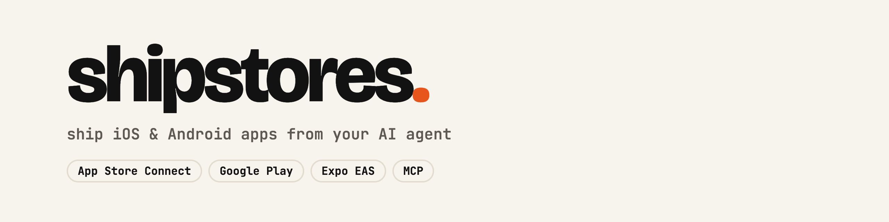
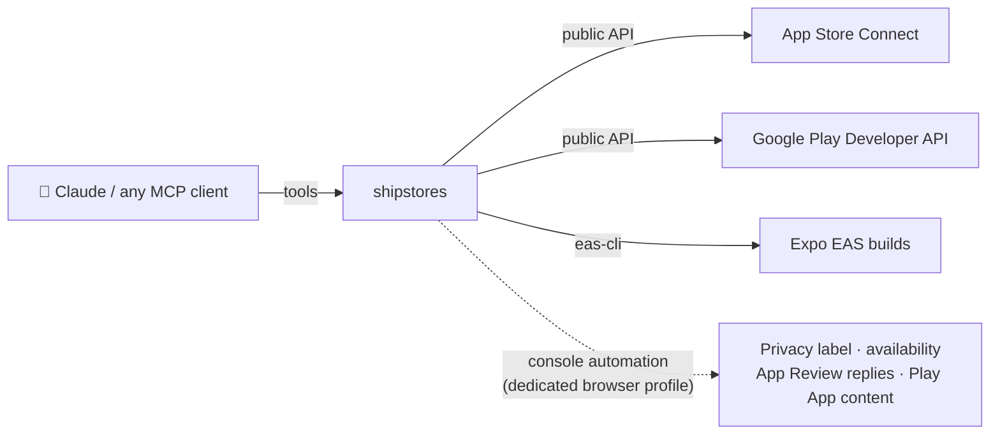

<p align="center">
  <picture>
    <source media="(prefers-color-scheme: dark)" srcset="assets/banner-dark.png">
    
  </picture>
</p>

<p align="center">
  <a href="LICENSE"></a>
  
  
  
  <a href="https://github.com/FidelisMM/shipstores/actions/workflows/ci.yml"></a>
  <a href="https://github.com/FidelisMM/shipstores/stargazers"></a>
</p>

<p align="center">
  <a href="#quick-start">Quick start</a> ·
  <a href="#tools">60 tools</a> ·
  <a href="#workflows">Workflows</a> ·
  <a href="#hard-won-lessons">Hard-won lessons</a> ·
  <a href="CONTRIBUTING.md">Contributing</a>
</p>

---

**shipstores** drives App Store Connect and Google Play Console end to end — builds, store listings, screenshots, privacy labels, review submission and even replying to App Review — so Claude (or any MCP client) can take an app from `eas build` to "Waiting for Review" without you clicking through two consoles.

> Built because publishing was always the slowest part of shipping an app. Every quirk documented below cost at least one rejected build to discover.



## Why

Publishing a mobile app is ~40 manual steps across two consoles, half of which have no public API. AI agents can write your app, but they stall at the store. This server closes that gap:

| | App Store Connect | Google Play |
|---|---|---|
| Upload build, versions, listing, screenshots | ✅ API | ✅ API |
| Subscriptions / in-app purchases | ✅ API | — |
| Age rating, categories, price, URLs | ✅ API | ✅ API |
| **Privacy label & country availability** | ✅ console's internal API | ✅ Data safety via console |
| **Read the rejection & reply to App Review (with video)** | ✅ console | — |
| **"App content" declarations** (11 forms, no API) | — | ✅ console automation |
| Create the app record | 🧭 opens the right form, tells you what to type | 🧭 same |
| Expo / EAS builds | ✅ start, poll, download, submit | ✅ |

Neither store lets anyone create an app record through an API, so `*_create_app_form` opens the right page in a logged-in browser and returns the exact values to fill. Everything else is automated.

## Quick start

Requirements: Python 3.12+, [uv](https://docs.astral.sh/uv/), an App Store Connect API key and/or a Google Play service account. Xcode command line tools for iOS uploads (`xcrun altool`).

Add it to Claude Code (no clone needed, `uvx` fetches it from [PyPI](https://pypi.org/project/shipstores/) and runs it):

```bash
claude mcp add shipstores \
  -e ASC_KEY_ID=ABC123XYZ \
  -e ASC_ISSUER_ID=00000000-0000-0000-0000-000000000000 \
  -e ASC_PRIVATE_KEY_PATH=~/.config/shipstores/AuthKey_ABC123XYZ.p8 \
  -e PLAY_SERVICE_ACCOUNT_PATH=~/.config/shipstores/play-service-account.json \
  -- uvx shipstores
```

Then ask your agent: *"run store_doctor"*. It checks both credentials with real calls and detects your Apple Team ID for you.

### Credentials

| Variable | Required | What it is |
|---|---|---|
| `ASC_KEY_ID`, `ASC_ISSUER_ID` | iOS | App Store Connect → Users and Access → Integrations → API key (role **Admin** or **App Manager**) |
| `ASC_PRIVATE_KEY_PATH` | iOS | the `.p8` file (default `~/.config/shipstores/AuthKey_<KEY_ID>.p8`) |
| `APPLE_TEAM_ID` | no | detected by `store_doctor` from any bundle ID |
| `PLAY_SERVICE_ACCOUNT_PATH` | Android | service account JSON invited in Play Console with release permissions |
| `PLAY_DEVELOPER_ID` | console forms | the number after `/developers/` in the Play Console URL |

Values can also live in `~/.config/shipstores/config.toml` — see [`config.example.toml`](config.example.toml). Nothing secret is ever written to the repo.

### Console features (optional)

Privacy labels, availability, App Review replies and Play "App content" forms run through the store consoles' own web endpoints in a dedicated, logged-in browser profile, driven by [browser-harness](https://github.com/browser-use/browser-harness). Log in once:

```bash
uvx --from shipstores python -m shipstores.browser login   # opens a window; sign in to both consoles (2FA included)
```

> ⚠️ These features use undocumented console endpoints (the same family fastlane's Spaceship relies on). They work today and are isolated behind small modules, but Apple or Google can change them without notice. PRs that keep them working are very welcome.

## Tools

**Diagnostics** — `store_doctor`, `store_browser_session`, `store_audit_identity`

**Apple: build & release** — `apple_list_apps`, `apple_register_bundle_id`, `apple_create_app_form`, `apple_upload_build`, `apple_list_builds`, `apple_create_version`, `apple_list_versions`, `apple_set_version_string`, `apple_attach_build`, `apple_submit_for_review`, `apple_resubmit_for_review`, `apple_cancel_submission`, `apple_testflight_invite`

**Apple: listing & app setup** — `apple_update_listing`, `apple_upload_screenshots`, `apple_set_app_info` (subtitle, URLs, categories, copyright, content rights), `apple_set_age_rating`, `apple_set_free_price`, `apple_set_availability`, `apple_set_app_privacy`, `apple_review_details`, `apple_set_review_details`

**Apple: App Review** — `apple_review_messages` (read the rejection and its guideline), `apple_reply_review` (answer with text + attachments; iPhone HEVC videos are converted to H.264)

**Apple: subscriptions** — `apple_create_subscription_group`, `apple_create_subscription`, `apple_list_price_points`, `apple_set_subscription_price`, `apple_set_subscription_availability`, `apple_create_intro_offer`, `apple_list_subscriptions`, `apple_upload_subscription_screenshot`

**Google Play** — `play_create_app_form`, `play_track_status`, `play_upload_bundle`, `play_promote_release`, `play_update_listing`, `play_upload_screenshots`, `play_list_screenshots`, `play_contact_details`, `play_set_contact_details`, `play_signing_sha1`, `play_submission_status`, `play_submit_for_review`

**Play Console forms** — `play_content_status`, `play_content_open`, `play_content_options`, `play_content_answer`, `play_content_save`, `play_data_safety_fill`, `play_data_safety_export`, `play_data_safety_import`

**Expo / EAS** — `eas_build_list`, `eas_build_start`, `eas_build_status`, `eas_build_download`, `eas_submit`

Tools that publish or submit (`apple_submit_for_review`, `apple_resubmit_for_review`, `apple_reply_review`, `apple_cancel_submission`, `apple_set_*`, `apple_testflight_invite`, `play_upload_bundle`, `play_promote_release`, `play_upload_screenshots`) say so in their description, so the agent confirms with you first.

## Workflows

**New iOS app**
```
apple_register_bundle_id → apple_create_app_form → [fill in the browser]
→ apple_list_apps → eas_build_start / apple_upload_build → apple_list_builds (wait for VALID)
→ apple_attach_build → apple_update_listing → apple_set_app_info → apple_set_age_rating
→ apple_set_free_price → apple_set_availability → apple_set_app_privacy
→ apple_upload_screenshots → apple_set_review_details → apple_submit_for_review
```

**New Android app**
```
play_create_app_form → [fill in the browser] → play_upload_bundle (track=internal)
→ play_update_listing → play_content_* / play_data_safety_fill → play_promote_release (production)
```

**Rejected with "Guideline 2.1 – Information Needed"** (standard for new developer accounts)
```
apple_review_messages → record the iPhone walkthrough → apple_set_review_details (answers in Notes)
→ apple_reply_review (answers + video) → apple_resubmit_for_review
```

## Hard-won lessons

The part people bookmark. Each one cost a rejected build or a lost afternoon.

**App Store Connect**
- **New developer accounts get "2.1 Information Needed" on the first submission**, regardless of app quality. Apple wants a screen recording from a *physical* device that starts at app launch from the Home Screen and shows login, the main flow and account deletion, plus purpose, access instructions, external services, regional differences and regulated-industry info — in the reply *and* in the review Notes. Replying is not enough: the version stays "Rejected" until you resubmit it (`apple_resubmit_for_review`, or "Update Review" on the version page).
- **Health apps must ship from an organization account** (Guideline 5.1.1(ix)). An app rejected on an individual account can't be transferred (transfers need a released version): it becomes a new app with a new bundle ID.
- **You can't learn your Team ID from the API until a bundle ID exists**; then it's the bundle's `seedId`.
- **Privacy label records need category + purpose + protection in the same record.** Separate records are accepted one by one, then publishing fails with *"An app data usage is missing a category/purpose or data protection type"*.
- **Availability needs every territory in the payload**, each flagged available or not — and the public API returns 409 anyway; the console endpoint works.
- **Cancelling a submission also cancels its subscriptions, and that can't be undone by API.** Re-adding them requires the console (details in [`docs/apple-subscriptions.md`](docs/apple-subscriptions.md)).
- **An app with an auto-renewable subscription is auto-rejected (3.1.2) without a working Terms of Use link** in the listing. The standard Apple EULA link fixes it without a new build.
- **`xcrun altool` won't take a key path argument**, but it honors `API_PRIVATE_KEYS_DIR`.
- **Screenshots belong to a version on iOS** (a released version won't accept new ones — create the next version) but to the listing on Play (live immediately).

**Expo / EAS**
- `eas submit --non-interactive` refuses App Store Connect API keys; this server downloads the `.ipa` and uploads with `altool` instead.
- `eas build:view` rejects `--non-interactive` ("Nonexistent flag") — a classic source of silent failures in wrappers.
- APNs keys are per team. After moving an app to another Apple team, a push key from the old team silently stops delivering (`InvalidProviderToken`).

**Google Play**
- The 11 "App content" declarations have no API. The Material radio `<input>` sits ~15px above the visible circle; clicking the center focuses but doesn't select. The accessibility tree is the source of truth.
- Play Console app and developer ids only appear in console URLs; no API resolves them from a package name.

## Contributing

Contributions are what make this useful for everyone — new stores' quirks change monthly. See [CONTRIBUTING.md](CONTRIBUTING.md). Good first issues are labeled [`good first issue`](https://github.com/FidelisMM/shipstores/labels/good%20first%20issue).

### Contributors

<a href="https://github.com/FidelisMM/shipstores/graphs/contributors">
  
</a>

## Star history

<a href="https://star-history.com/#FidelisMM/shipstores&Date">
  <picture>
    <source media="(prefers-color-scheme: dark)" srcset="https://api.star-history.com/svg?repos=FidelisMM/shipstores&type=Date&theme=dark" />
    
  </picture>
</a>

## License

[MIT](LICENSE) © Matheus Fidelis. Not affiliated with Apple or Google; App Store Connect and Google Play are trademarks of their owners.
